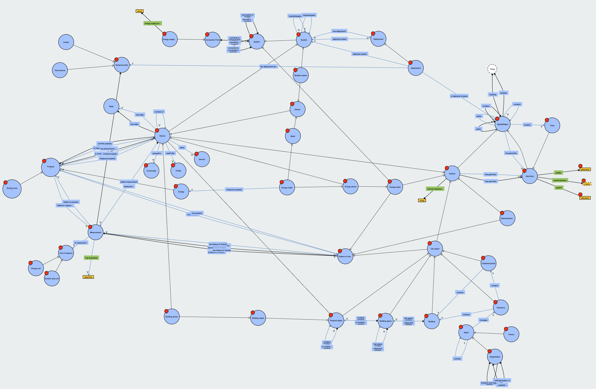

# Bigg Ontology


## Project Description
This ontology is designed to represent the domain of buildings energy measurements. It provides a formal structure to describe buildings, consumptions, weather, KPIs, and their relationships.

### Purpose and Objectives
- **Purpose**: Facilitate the organization and tracking of projects through a structured and formalized representation.
- **Objectives**: Improve buildings management, facilitate interoperability between systems, and provide a basis for developing data driven analysis and visualization tools.

### Motivations
- Crear una ontologia que permita caracterizar tanto edificios como zonas urbanas para su posterior analisis.

## Repository Structure
The repository is organized as follows:
- `ontology/`
  - `ontology.ttl`: Main ontology file in Turtle format.
- `extension/`
  - `tariff.ttl`: Bigg ontology extension for Tariff in Turtle format.
  - `bigg4kpi.ttl`: Bigg ontology extension for energy kpi in Turtle format.
- `docs/`
  - `BiggOntology.drawio`: UML schema of the ontology.

## Installation
### Prerequisites
- [Protegé](https://protege.stanford.edu/): To view and edit the ontology.

### Installation Steps
1. Clone this repository:
   ```bash
   git clone https://github.com/BeeGroup-cimne/biggontology.git

