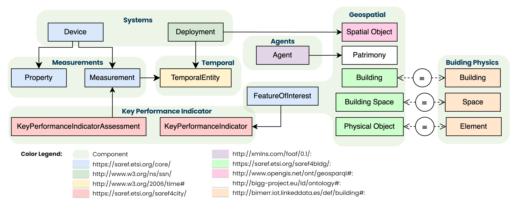
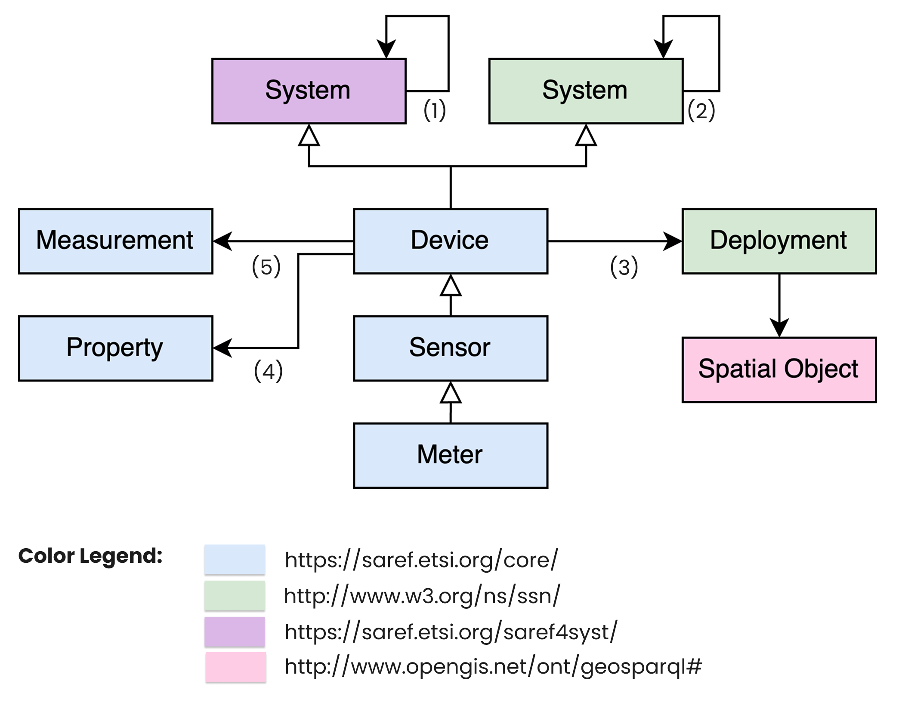
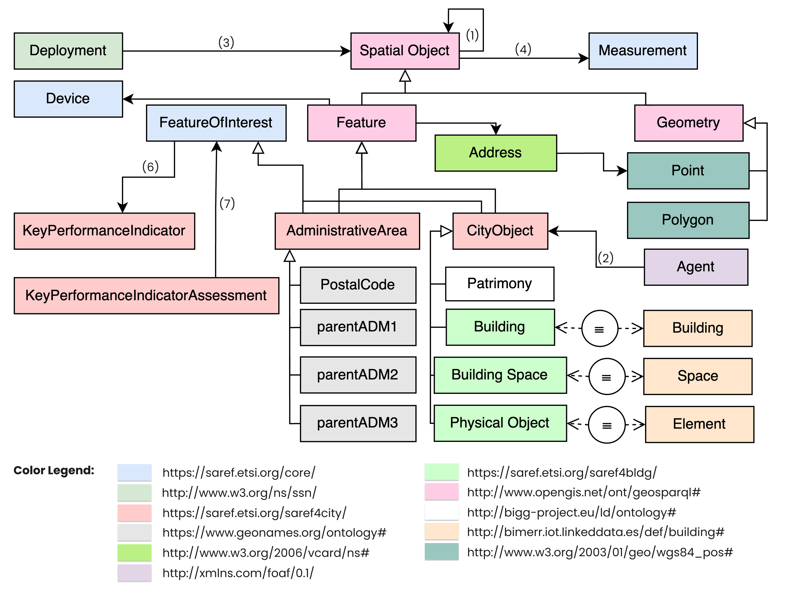
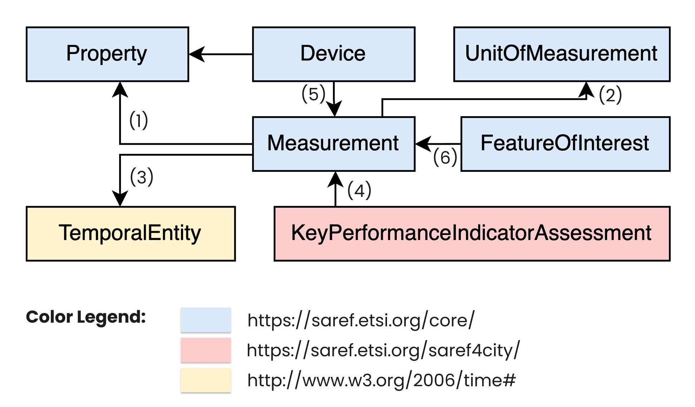
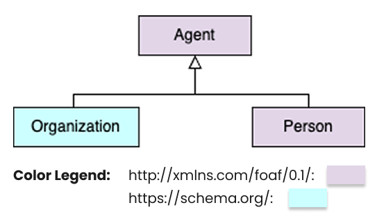
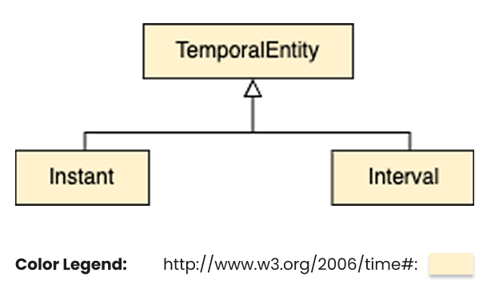
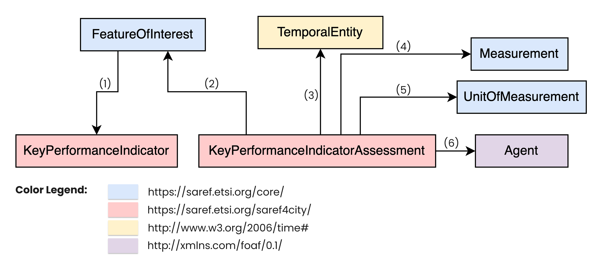

# BIGG Ontology

The BIGG Ontology is an open-source initiative that establishes a standardised schema
for describing, characterising, and analysing buildings and urban areas. It was mainly developed in the framework of multiple private and public funded projects, some of them are: BIGG (EU-Horizon project), ENTRACK (EU-Horizon project) and Climate Ready Barcelona (ICLEI's Action Fund 2.0 project). This ontology supports urban planning, building
management, and sustainable development by creating a shared vocabulary for researchers and practitioners. This common
language facilitates the sharing and integrating information within the urban development domain. The ontology also
includes a framework for defining measurements and key performance indicators (KPIs) to enable precise evaluation and
benchmarking of building and urban area performance. This repository documents the ongoing development of the ontology
and provides essential resources for its application.



The BIGG ontology uses the Terse RDF Triple Language (Turtle) to represent information. It is built using the Web
Ontology Language (OWL), which is based on the Resource Description Framework (RDF) XML standard set by the World Wide
Web Consortium (W3C). This method guarantees a strong and standardized framework for representing and exchanging
semantic data within the ontology.

## Key Components

The BIGG ontology is divided into 5 main components:

- **Systems**: Describe and analyze the various systems, sensors, devices, and weather stations within buildings and
  urban areas, including their functions, interconnections, and performance. This ensures efficient operation,
  maintenance, and integration of systems, leading to enhanced overall building performance and reliability.

  <p align="center"></p>

- **Geospatial**: Capture and analyze spatial characteristics and geographic information of buildings and urban areas.
  This supports urban planning, optimal land use, site selection, and environmental impact assessments, thereby
  facilitating informed decision-making and efficient spatial management.

  <p align="center"></p>

- **Measurements**: Catalogue and standardize the various devices and sensors used in buildings and urban areas for data
  collection and control. This includes meters, thermostats, smart appliances, and sensors measuring temperature,
  humidity, occupancy, and energy consumption. Standardizing these devices and sensors ensures accurate and consistent
  data capture across different environments, facilitating reliable monitoring, data collection, analysis, and informed
  decision-making.

  <p align="center"></p>

- **Agents**: Identify and categorize the various stakeholders and entities involved in the lifecycle of buildings and
  urban areas. This promotes effective coordination, compliance with regulations, and collaboration among stakeholders,
  leading to more efficient and cohesive management of urban environments.

  <p align="center"></p>

- **Temporal**: Address the timing of events, lifecycle phases of systems and components, and historical data related to
  buildings and urban areas. This enables time-based analysis and planning, prediction of future needs, scheduling of
  maintenance activities, and evaluation of long-term trends, ensuring proactive management and sustainability of urban
  assets.

  <p align="center"></p>

## Extensions

- **KPI**: Establish a set of standardized metrics for evaluating the performance of buildings and urban areas. These
  KPIs allow for benchmarking, performance assessment, and identifying areas for improvement, supporting strategies for
  enhanced efficiency and sustainability.

  <p align="center"></p>

## Dictionaries & Taxonomies

##### External Sources

- **all-geonames-rdf-clean-ES.rdf** -> [GeoNames](https://www.geonames.org/): Data on municipalities, provinces,
  regions, and countries.
- **qudt.ttl** -> [QUDT](https://qudt.org/): Units of measure.

##### Custom generation of taxonomies for the project

- **AreaType.ttl** -> Defines categories of buildings and administrative areas, such as GrossFloorArea,
  BuiltUpLandArea, and GrossFloorAreaAboveGround.
- **MainUses.ttl** -> Outlines primary uses of areas or properties, including residential, retail, industrial,
  agricultural, and public services uses.
- **MeasuredProperty.ttl** -> Specifies properties measured in geographical areas, such as area, consumptions,
  elevation, and temperature.

## Purpose and Objectives

- **Purpose**: Facilitate the organization and tracking of projects through a structured and formalized representation.
- **Objectives**: Establish a formal framework for describing and categorizing different aspects of buildings and urban
  areas. This will enhance our comprehension and management of urban elements, streamline building management, promote
  interoperability between systems, and lay the groundwork for creating data-driven analysis and visualization tools.
  Ultimately, this will simplify the analysis process and support the design of policies and strategies for sustainable
  urban development.

## Motivations

- **Complexity of Urban Environments**: The intricate nature of urban areas requires a comprehensive framework to manage
  and analyze various elements effectively in order to address their complexity and interconnectedness.
- **Data Integration**: Integrating disparate data sources and systems is essential to achieve a cohesive understanding
  of urban environments
  and enhance decision-making and management of urban dynamics.
- **Sustainability Goals**: The increasing focus on sustainable development necessitates precise tools and methods for
  planning and managing urban
  growth that align with sustainability objectives.
- **Technological Advancements**: Leveraging new technologies presents opportunities to improve data collection,
  analysis, and visualization which are vital for understanding urban environments and making informed decisions.
- **Policy Development**: Robust data-driven insights are in high demand to guide the development of policies and
  strategies that address the challenges of urban growth and ensure sustainable development for the future.

## Repository Structure

The repository is organized as follows:

- `ontology/`
    - `ontology.ttl`: Main ontology file in Turtle format.
    - `geonames.ttl`: Geonames ontology file in Turtle format.
    - `material.ttl`: Materials ontology file in Turtle format.
    - `building.ttl`: Building ontology file in Turtle format.
    - `SAREF4BLDGAlignment.ttl`: Alignment module between saref4bldg and bot ontology in Turtle format.
- `extensions/`
    - `bigg4tariff.ttl`: Bigg ontology extension for Tariff in Turtle format.
    - `bigg4kpi.ttl`: Bigg ontology extension for energy kpi in Turtle format.
- `schema/`
    - `BiggOntology.drawio`: UML schema of the ontology.
- `resources/`: Contains images and additional files.
- `use_cases/`
    - `barcelona_use_case/`: Use case of the Bigg ontology with the city of Barcelona.
    - `montreal_use_case/`: Use case of the Bigg ontology with the city of Montreal.

## Edit/View

- Editing and viewing tools [Protegé](https://protege.stanford.edu/) & [Webvowl](https://service.tib.eu/webvowl/)
- Editing and viewing library [Owlready](https://owlready2.readthedocs.io/en/latest/)

## Use Cases

### Barcelona use case

The [Barcelona use case](use_cases/barcelona_use_case/README.md), is part of the [Climate Ready Barcelona project](https://www.climatereadybcn.eu/), aimed at developing a high-resolution Heat Vulnerability Index for each building in the city. This index captures the multifactorial susceptibility of urban environments to extreme heat events, combining aspects of exposure, sensitivity, and adaptive capacity. To achieve this, diverse datasets—ranging from administrative boundaries to energy consumption records and environmental indicators—have been integrated and semantically aligned using the BIGG ontology. The main challenge addressed in this use case is the need to harmonise data of varying spatial granularities, temporal resolutions, and thematic coverage to enable meaningful analysis and decision-making. Through the ontology’s modular structure—particularly the Geospatial, Systems, Measurements, and KPI components—the process enables consistent annotation, semantic linkage, and inferencing across building-level indicators. 

Key Performance Indicators (KPIs) are the core mechanism for quantifying vulnerability across the building stock. In many cases, these KPIs are not directly available from observations, requiring their estimation through simulation models or predictive algorithms. These estimations are informed by the harmonised data model, ensuring consistent semantics and data interoperability. All KPIs, once derived, are stored and queried through the BIGG ontology structure, supporting downstream applications such as risk mapping, policy targeting, and adaptation planning.

### Montreal use case

The [Montreal use case](use_cases/montreal_use_case/README.md) focuses on developing an integrated semantic data infrastructure to accurately simulate and calibrate building energy demand across the city’s Regional Territorial Areas (RTAs). Utilizing the BIGG ontology, heterogeneous datasets—including cadastral data, building materials information, and temporally-resolved energy consumption data—are harmonised to enhance interoperability and facilitate precise energy simulations.

The principal challenge addressed in this case involves integrating initially disconnected cadastral vector data with energy consumption records. The modular structure of the BIGG ontology—particularly its Geospatial, Systems, Measurements, Building Physics, and Key Performance Indicators (KPI) components—enables effective semantic linkage and contextualization of these diverse datasets. Additionally, simulation outputs based on the [HUB Python library](https://ngci.encs.concordia.ca/gitea/CERC/hub), developed by the CERC group in Concordia University, play a critical role by providing detailed building descriptions, internal spatial zoning, thermal boundaries, associated material layers, and thermal demand estimations using [EnergyPlus](https://energyplus.net/) 

## Instalation

### Installation Steps

1. Clone this repository:
   ```bash
   git clone https://github.com/BeeGroup-cimne/biggontology.git

## Authors

- Jose Manuel Broto - jmbroto@cimne.upc.edu
- Edgar Martínez-Sarmiento
- Eloi Gabaldón - egabaldon@cimne.upc.edu
- Guillaume Picinbono
- Nicolas Bus
- Stoyan Danov
- Jordi Carbonell - jordi@cimne.upc.edu

Copyright (c) 2025 Jose Manuel Broto, Edgar Martínez-Sarmiento, Eloi Gabaldon, Guillaume Picinbono, Nicolas Bus, Stoyan Danov, Jordi Carbonell

